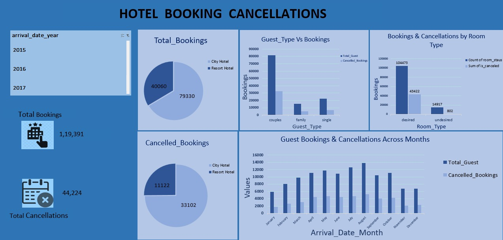

# Hotel-Booking-Cancellations
🏨 Hotel Booking Cancellations – Data Analysis Project

## 📌 Project Overview
This project analyzes **hotel booking and cancellation patterns** using Excel dashboards.  
The goal is to identify insights into **guest behavior, seasonal trends, and room type preferences**.

---

## 📊 Key Insights
- 📈 **Total Bookings:** 1,19,391  
- ❌ **Total Cancellations:** 44,224  
- 🏨 **City Hotel** had more cancellations compared to Resort Hotel  
- 👫 **Couples** made the highest number of bookings  
- 📅 Cancellations peak during **summer months**  
- 🛏️ **Room Type preferences** (desired vs undesired) influenced cancellations  

---

## 🛠 Tools & Techniques
- Excel (Pivot Tables, Charts, Dashboarding)
- Data Cleaning & Visualization

---

## 📸 Dashboard

---

## 📂 Project Files
- `Hotel_Booking_Data.xlsx` → Dataset & analysis
- `Dashboard.png` → Visualization of insights
- `README.md` → Project description

---

## 🚀 Future Improvements
- Automate analysis with Python (Pandas, Matplotlib, Seaborn)  
- Build an interactive dashboard using Power BI or Tableau  

